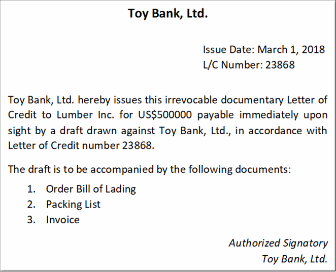
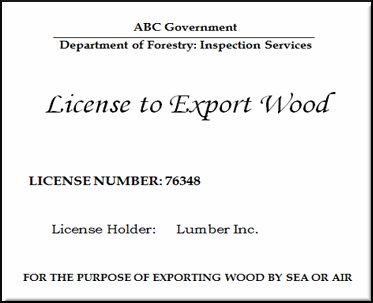
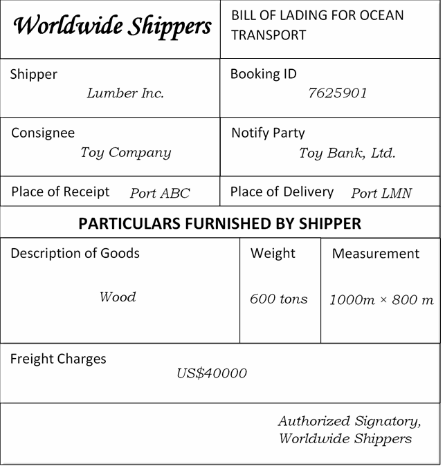
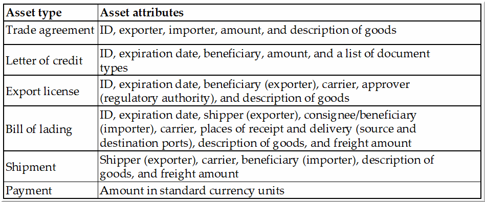
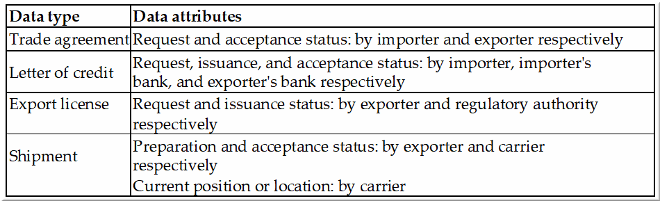

# Trade Workflow
This is a use case on trade finance and logistics, designed to demonstrate the capabilities of Hyperledger (mainly Fabric) blockchain tools.

# Participants
The trade workflow consists of 6 participants:
- *Exporter*: An entity that is selling goods
- *Importer*: An entity that is buying goods from an exporter in exchange for money
- *Importer's Bank*: Maintains a bank account for an importer, and issues a Letter of Credit on its behalf
- *Exporter's Bank*: Maintains a bank account for an exporter, and handles L/Cs and payments on its behalf
- *Carrier*: Entity that ships goods from exporter's to importer's location.
- *Regulatory Auhority*: Public or governmental body that approves the export of goods, and audits the process

# Inspiration for this Use Case
International trade raises the kinds of situations that starkly illustrate the inefficiencies and lack of trust in real-world processes that blockchains were designed to mitigate.
We select a small slice of an import/export scenario with simplified versions of real-world transactions as our canonical use case in this chapter.
The user will get a hands-on Hyperledger Fabric development experience with an application that is practically useful and can be a model for most enterprise applications.
The user will also gain an appreciation for the unique features that Fabric (and blockchain technology in general) provides and the rationale for design choices made by Fabric platform designers.

# Scenario Overview
The scenario we describe involves a simple transaction: the sale of goods from one party to another. This transaction is complicated by the fact that the buyer and the seller lie in different countries and there is no common trusted intermediary to ensure that the exporter gets the money it was promised and the importer gets the goods it was promised. Such trade arrangements in today’s world rely on:
- Intermediaries that facilitate the payments and the physical transfer of goods, and
- Processes that have evolved over time to enable exporters and importers to hedge their bets and reduce the risks involved.

## Real-World Process
The intermediaries that facilitate payment are the respective banks of the exporter and the importer. The trade arrangement is fulfilled by the existing trust relationships between a bank and its client, and between the two banks. Such banks typically have international connections and reputations to maintain. Therefore, a commitment (or promise) by the importer's bank to make a payment to the exporter's bank is enough to trigger the process. The goods are dispatched by the exporter through a reputed international carrier after obtaining regulatory clearances from the exporting country's government.   
Proof of handoff (of the goods) to the carrier is enough to clear payment from the importer's bank to the exporter's bank, and such clearance is not contingent on the goods reaching their intended destination (it is assumed that the goods are insured against loss or damage in transit.) The promise made by the importer's bank to pay the exporter's bank can be formalized through an instrument like the _letter of credit_, which specifies a list of documents that are required as proof of dispatch, and the precise method of payment to be made immediately or over a period. Various regulatory requirements must be fulfilled by the exporter before getting documentary clearances that allow it to hand off the goods to the carrier.

## Simplified and Modified Process for Implementation
Our use case will follow a simplified version of the real-world process, with certain variations to demonstrate the value of blockchain not just in facilitating trade but also in opening new possibilities. A promise of payment in two installments is made by the importer's bank to the exporter's bank. The exporter obtains a clearance certificate from the regulatory authority, hands off the goods to the carrier, and then obtains a receipt in the form of a _bill of lading_. The production of the receipt triggers the first payment installment from the importer's bank to the exporter's bank. When the shipment has reached the destination port, the second and final payment installment is made, and the trade's life-cycle ends.

# Terms Used in Trade Finance and Logistics
Below are real-world instruments and artifacts used in international trade. In our implementation, we use simplified versions of these.
- __Letter of Credit__: This refers to a bank's promise to pay an exporter upon presentation of documentary proof of goods having been shipped. Called L/C for short, this document is issued by the importer's bank at the request of its client: the importer. The L/C states the list of documents that constitute proof of shipment, the amount to be paid, and the beneficiary (the exporter in our case) of that amount. A sample L/C is illustrated below:

    

    We will introduce small variations in our use case to make this instrument comprehensible to the reader. Firstly, the L/C will be issued to the exporter's bank rather than directly to the exporter. Secondly, the L/C states that payment will be made in two identical installments, the first upon production of two documents and the second upon the goods reaching their destination.

- __Export Licence__: This refers to the approval given by the regulatory authority in the exporter's country for the shipment of the specified goods. Here, we will refer to it as E/L for short. A sample E/L is illustrated below:

    

- __Bill of Lading__: This is a document issued by the carrier to the exporter once it takes possession of the shipment. Called B/L for short, it simultaneously serves as a receipt, a contract obliging the carrier to transport the goods to a specified destination in return for a fee, and a title of ownership of the goods. This document is also listed in the L/C (as you can see in the sample letter issued by Toy Bank, Ltd.) and serves as proof of shipment dispatch that will automatically trigger a payment clearance. A sample B/L is illustrated below:

    

# Shared Process Workflow
This is sequence of steps in our trade workflow:
1. Importer requests goods from the exporter in exchange for money
2. Exporter accepts the trade deal
3. Importer asks its bank for an L/C in favor of the exporter
4. The importer's bank supplies an L/C in favor of the exporter, and payable to the latter's bank
5. The exporter's bank accepts the L/C on behalf of the exporter
6. Exporter applies for an E/L from the regulatory authority
7. Regulatory authority supplies an E/L to the exporter
8. Exporter prepares a shipment and hands it off to the carrier
9. Carrier accepts the goods (optionally: after validating the E/L), and then supplies a B/L to the exporter
10. Exporter's bank claims half the payment from the importer's bank
11. Importer's bank transfers half the amount to the exporter's bank
12. Carrier ships the goods to the destination
13. Importer's bank pays the remaining amount to the exporter's bank

# Shared Assets and Data
The following is a table of the assets owned by the participants, which are shared with each other to drive the process from one stage to the next. This includes documentary and monetary assets.

The following are the data elements that circumscribe the options available to participants in each stage of the workflow.

# Participants' Roles and Responsibilities
- Only an importer may apply for an L/C
- Only an importer's bank may supply an L/C
- Only an exporter's bank may accept an L/C
- Only an exporter may request an E/L
- Only a regulatory authority may supply an E/L
- Only an exporter may prepare a shipment
- Only a carrier may supply a B/L
- Only a carrier may update a shipment location
- Only an importer's bank may send money, and only an exporter's bank may receive money

