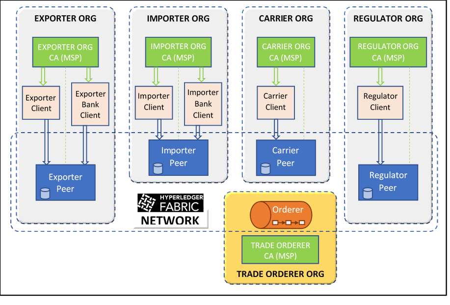
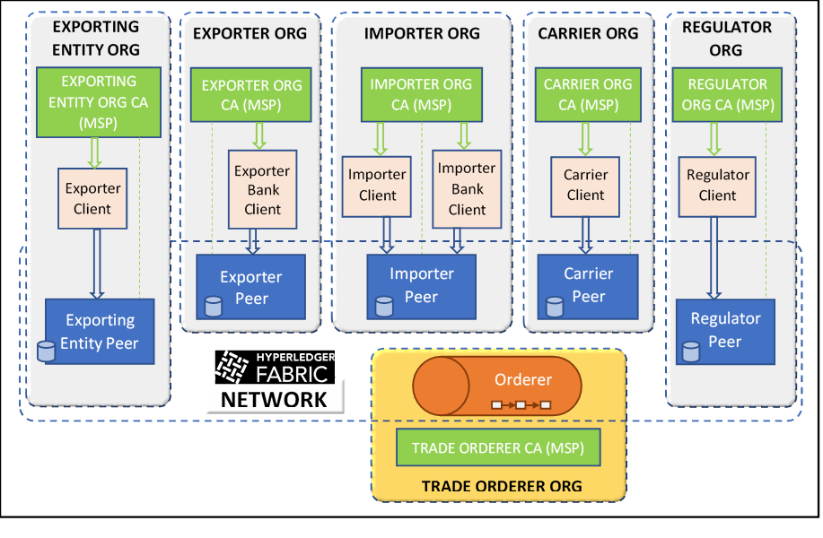

# Running a Trade Network on Hyperledger Fabric using Bash Scripts and Docker Containers
This folder contains all the tools necessary to create, operate, and enhance a trade network that we can build our [use case](../USE-CASE.md) on.

# Prerequisites to Configure and Launch the Network
Our application code is pegged to the latest release of Hyperledger Fabric (`v2.2.0`) and Fabric-CA (`v1.4.7`). These correspond to the source code branches `release-2.2` (for Fabric) and `release-1.4` (for Fabric-CA) respectively.   
The launch scripts will automatically pull the right Docker images from Docker Hub, but you can also build the images locally by cloning the source code.   
Here are the prerequisites you need to install on your system before attempting to run any of the scripts. The instructions below work for Ubuntu Linux (tested on `18.04` and `20.04`) and will also likely work for Macs, though some adaptations may be required.
- Tools and packages: `build-essential`, `git`, `make`, `curl`, `unzip`, `g++`, `libtool` (you can install several of these with a single `libltdl-dev` package)
- Install `docker` (version `17.06.2-ce` or higher) and `docker-compose` (version `1.14.0` or higher)
- Install `node` (version `10.15` or higher) and `npm`
    ```
    curl -sL https://deb.nodesource.com/setup_10.x | sudo -E bash –
    sudo apt-get install -y nodejs
    ```
- Install Golang (version `1.14` or higher)
  * Select a workspace directory where you want to store your Go projects
  * Set the `GOPATH` environment variable to point to that directory
- (For Mac OSX) Make sure you are using GNU Tar:
  `brew install gnu-tar --with-default-names`
- Download and build [Fabric](https://github.com/hyperledger/fabric/) `release-2.2` branch, and make appropriate settings:
    ```
    mkdir -p $GOPATH/src/github.com/hyperledger
    cd $GOPATH/src/github.com/hyperledger
    git clone -b release-2.2 https://github.com/hyperledger/fabric/
    cd fabric
    make configtxgen cryptogen
    export PATH=$PATH:$GOPATH/src/github.com/hyperledger/fabric/build/bin
    make docker
    ```
- Download and build [Fabric-CA](https://github.com/hyperledger/fabric-ca/) `release-1.4` branch:
    ```
    cd $GOPATH/src/github.com/hyperledger
    git clone -b release-1.4 https://github.com/hyperledger/fabric-ca/
    make docker
    ```
# Initial Trade Network and Applications
The initial network has four organizations, each with one peer and CA, as illustrated in the below diagram. All peers other than the one in the Carrier's organization uses a CouchDB instance as its backing database. (The carrier peer uses the default LevelDB).



## Organization and Channel Configurations
We can use either a solo or a Raft ordering service using either of the following compose files (which in turn depend on compose files in [base](base/):
- _Solo_: [docker-compose-e2e.yaml](docker-compose-e2e.yaml)
- _Raft_: [docker-compose-raft-orderer.yaml](docker-compose-raft-orderer.yaml)

Cryptographic material specifications are provided in [crypto-config.yaml](crypto-config.yaml), with the additional Raft ordering nodes specified in [multiple_orderers/crypto-config.yaml](multiple_orderers/crypto-config.yaml)

We use two channels, each supporting a different consortium as follows (see [configtx.yaml](configtx.yaml) for solo orderer and [multiple_orderers/configtx.yaml](multiple_orderers/configtx.yaml) for raft orderer):
- `tradechannel`: `TradeConsortium` (3 organizations: exporter, importer, regulator)
- `shippingchannel`: `ShippingConsortium` (4 organizations: exporter, importer, regulator, carrier)

**The instructions below use default options. For a complete list of commands and options, run:** `./trade.sh -h`

## Build Channel Artifacts and Crypto Material
Run the following to build artifacts for both channels. These commands will not overwrite an existing `crypto-config` folder, so the second command will only generate channel artifacts.
```
./trade.sh generate -c tradechannel -o 3 [-m prod]
./trade.sh generate -c shippingchannel -o 4 [-m prod]
```
The `-m prod` switch will create artifacts for a Raft ordering service. By default, i.e., without this switch, artifacts for a solo ordering service will be created. Whichever option you select, you MUST stick to that option for all subsequent steps.
The following files and folders should be created:
```
├── channel-artifacts
|   └── genesis.block
|   └── tradechannel
|       └── channel.tx
|       └── ExporterOrgMSPanchors.tx
|       └── ImporterOrgMSPanchors.tx
|       └── RegulatorOrgMSPanchors.tx
|   └── shippingchannel
|       └── channel.tx
|       └── ExporterOrgMSPanchors.tx
|       └── ImporterOrgMSPanchors.tx
|       └── RegulatorOrgMSPanchors.tx
|       └── CarrierOrgMSPanchors.tx
├── crypto-config
|   └── ordererOrganizations
└   └── peerOrganizations
```
- `crypto-config/ordererOrganizations/trade.com/orderers/` may have one (solo) or five (Raft) subfolders, each corresponding to an ordering node
- `crypto-config/peerOrganizations/`: will have 4 subfolders, one corresponding to each org

## Launch the Network
Run the following command to start the network:
```
./trade.sh up [-m prod]
```
- By default, this runs the network as a background process, and logs the output to `logs/network.log`.
- To use a different log file, run `./trade.sh up [-m prod] -l <log-file-name>`.

## Start and Join Channels
Run the following command to create both channels, join peers of organizations belonging to the respective consortiums to the channels, and set anchor peers for the channels
```
./startAndJoinChannels.sh
```
- All the action happens in the `trade_cli` container, and is recorded in `logs/network-cli.log`.

## Install and Initialize Contracts
_Prerequisite_: Make sure the latest versions of the contracts (`trade-contracts` repository) are synced to the [contracts submodule folder](../contracts/)
Run the following command to package, install, approve and commmit definitions, and initialize the following contracts on particular channels:
- [trade](../contracts/v1/trade): `tradechannel`
- [letterOfCredit](../contracts/v1/letterOfCredit): `tradechannel`
- [exportLicense](../contracts/v1/exportLicense): `shippingchannel`
- [shipment](../contracts/v1/shipment): `shippingchannel`
```
./sampleChaincodeOperations.sh
```
- All the action happens in the `trade_cli` container, and is recorded in `logs/network-cli.log`.

## Run the Role-Specific Server Applications
_Prerequisite_: Make sure the latest versions of the applications (`trade-apps` repository) are synced to the [apps submodule folder](../apps/)

### Initialize Wallet and Gateway Folders
Create the following folder structure in preparation to store identities and connection profiles for the organizations:
```
trade-network
├── wallets
|   └── exporterorg
|   └── importerorg
|   └── regulatororg
|   └── carrierorg
├── gateways
|   └── exporterorg
|   └── importerorg
|   └── regulatororg
└   └── carrierorg
```

### Create Connection Profiles
Create a connection profile within each subfolder under `gateways`. For example: `gateways/exporterorg/connection.json`.   
To create these profiles, use scripts in the [utils](utils/) folder. Prepare to run the scripts by running the following commands:
```
cd utils
npm install
```
You can export connection profiles for the organizations from the VSCode IBP Extension, and fix their attributes by running the following commands:
```
cd utils
node manage-connection-profile.js --update <vscode-exporterorg-connection-profile> ../../gateways/exporterorg/connection.json ca-exporterorg
node manage-connection-profile.js --update <vscode-importerorg-connection-profile> ../../gateways/importerorg/connection.json ca-importerorg
node manage-connection-profile.js --update <vscode-regulatororg-connection-profile> ../../gateways/regulatororg/connection.json ca-regulatororg
node manage-connection-profile.js --update <vscode-carrierorg-connection-profile> ../../gateways/carrierorg/connection.json ca-carrierorg
```
The arguments `<vscode-exporterorg-connection-profile>`, etc., should point to paths of the connection profiles exported from VSCode to your filesystem.   
Alternatively, you can generate the four connection profiles in one go using the following command:
```
cd utils
./generateAllProfiles.sh
```

### Launch the Applications
See instructions in the [apps folder](../apps/)   
You can run the integration tests after running the applications within docker containers, or you can start the four applications on your host machine and run operations and queries to drive trade workflows [manually](../apps/sample-cli/curl/).

## Bring Down the Network
Run the following command to bring down the network:
```
./trade.sh down [-m prod] [-r]
```
By default, this will stop all network containers and delete all ledger data (by deleting volumes) so you can restart a network from scratch. If you wish to retain ledger history and user acccounts, make sure you use the `-r` switch.

## Delete Dynamically Created Artifacts
To delete all user identities created by the CAs after launch (i.e., stored in [wallets](../wallets)) and all the chaincode containers created after the previous network launch, run:
```
./trade.sh reset
```
This will leave the `crypto-config` and `channel-artifacts` folders intact.

## Delete Dynamic Data and Channel Artifacts
To delete dynamically created identities, chaincode containers, and channel artifacts, run:
```
./trade.sh clean
```
This will leave the `crypto-config` folder intact.

## Delete All Static and Dynamic Artifacts
To delete dynamically created identities, chaincode containers, channel artifacts, and cryptographic material, run:
```
./trade.sh cleanall
```
This will allow you to rebuild a network from scratch. You will need start start from the beginning, from `./trade.sh generate...`.


# Trade Network Upgrades
Certain forms of network changes are supported, though in circumscribed ways. You can easily modify the scripts to run other kinds of upgrades though.

## Add a New Peer to the Importer Organization
The configuration for this new peer lies in the [add_peer_importer](add_peer_importer/) folder.   
To launch the peer container and its backing CouchDB container, run:
```
./trade.sh startnewpeer
```
To join the new peer to the two channels, run:
```
./trade.sh joinnewpeer -c tradechannel
./trade.sh joinnewpeer -c shippingchannel
```
To make this an endorsing peer, log into the tools container as follows:
```
docker exec -it trade_cli bash
```
Set the environment variables to appropriate values, and run the following package and install processes for each contract you wish to run on this peer. Use the [cli_scripts/chaincode.sh](cli_scripts/chaincode.sh) to run these processes.

### Remove the New Peer from the Importer Organization
To remove the peer from the network, run:
```
./trade.sh stopnewpeer
```

## Add a New Organization
We can add a new Exporting Entity Organization as illustrated in the figure below.



### Configure and Launch the New Organization
The configuration for the new organization lies in the [add_org](add_org/) folder.   
To augment the network in one go by:
- Updating the configurations of the two channels to represent augmented consortiums
- Starting the peer, CouchDB, and CA containers for the new organization
- Joining the peer to the two channels
- Setting the anchor peer of the new organization on both channels
Run:
```
./startAndJoinNewOrg.sh
```

### Stop the Exporting Entity Organization's Peer and CA
To stop the new organization's containers, run:
```
./trade.sh stopneworg
```

## Upgrading the Smart Contracts
You can upgrade the four smart contracts from [v1](../contracts/v1/) to [v2](../contracts/v2).   
For each contract, you will need to:
- Package and install the `v1` version of the contract on the Exporting Entity organization's peer, and approve the definition by that organization on each channel
- Package the `v2` version of the contract
- Install the `v2` version of the contract on the peers of all five organizaitons
- Approve the `v2` chaincode definition (including an endorsement policy update) by all five organizations on each channel
- Commit the `v2` chaincode definition on each channel
To upgrade all four contracts in one go, run:
```
./sampleUpgradeChaincodeOperations.sh
```

## Launching an Application Representing the New Organization
Create the following wallet and gateway folders:
```
trade-network
├── wallets
|   └── exportingentityorg
├── gateways
└   └── exportingentityorg
```
Create a connection profile for the new organization as follows:
```
cd utils
node manage-connection-profile.js --generate exportingentityorg ExportingEntityOrgMSP 12051 12054 --add-org
```
Launch the new application by following instructions in the [exportingentity application folder](../apps/exportingentity/).   
Run operations and queries to drive trade workflows on the new network [manually](../apps/sample-cli/curl/).

## Upgrade the Fabric Platform Version
You can upgrade the platform version while a network is live.   
Change the Fabric and Fabric-CA versions in [.env](.env).   
Edit the Fabric platform version (only the digit following the decimal), representd by the `FABRIC_VERSION` variable in [trade.sh](https://github.ibm.com/Hyperledger-Book-2nd-Edition/trade-network/blob/read_updates/bash/trade.sh#L1335).   
Run the upgrade as follows:
```
./trade.sh upgrade
```
